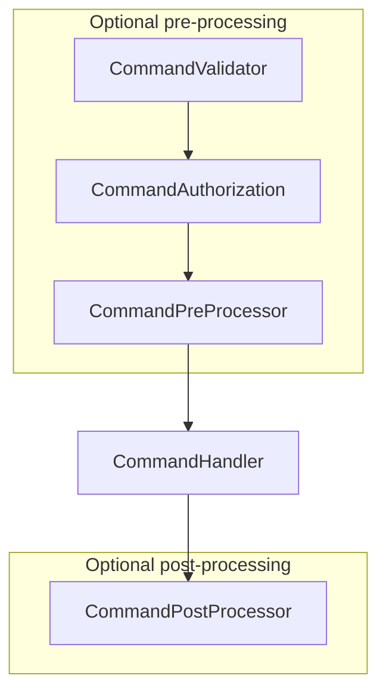

# Commands

## Introduction

TBD...

### Hello world sample

In this little sample of `Wemogy.CQRS` we will implement a command without parameters with the belonging command handler. Moreover we will register `wemogy.CQRS` in the dependency injection and finally execute the command to print a `Hello World!` on the console.

#### The Command model

For each command its required to create a model of the command itself, which contains all information which are required to execute the command.

```csharp
using Wemogy.CQRS.Commands.Abstractions;

public class HelloWorldCommand : ICommand
{
}
```

#### The Command handler

The second mandatory implementation for a command is a command handler, which contains the actual implementation of the command action.

```csharp
using System.Threading.Tasks;
using Wemogy.CQRS.Commands.Abstractions;
using Wemogy.CQRS.Commands.Structs;

public class HelloWorldCommandHandler : ICommandHandler<HelloWorldCommand>
{
  public Task HandleAsync(HelloWorldCommand command)
  {
    Console.WriteLine("Hello world!");
    return Task.CompletedTask;
  }
}
```

:::info

The `Void` type comes from `Wemogy.CQRS.Commands.Structs` and is used to describe a **generic** task without a result to return.

:::

#### Registering the command

It's required to execute `services.AddCQRS();` in your dependency injection file of the assembly which contains the commands. In addition its also supported to pass one or multiple assemblies to the `AddCQRS()` extension method, in case that you need to call it from another assembly.

#### Executing the command

This sample is part of a .NET Core controller class.

```csharp
using Wemogy.CQRS.Commands.Abstractions;

public class HelloWorldController : ControllerBase
{
  private readonly ICommands _commands;

  public HelloWorldController(ICommands commands)
  {
    _commands = commands;
  }

  [HttpGet]
  public async Task<ActionResult> SayHelloWorld()
  {
    // creating the command with all required information
    var helloWorldCommand = new HelloWorldCommand();

    // executing the command though the ICommands mediator
    await _commands.RunAsync(helloWorldCommand);

    return Ok();
  }
}
```

## How it works

### Execution pipeline

All commands are sent though the `ICommands` interface (mediator). They all will be processed in the same defined order:



:::info Convention
Place the command, the command-handler and all belonging handlers (like pre-processor) in the same folder:

- Commands/
  - CreateUser/
    - CreateUserCommand.cs
    - CreateUserCommandHandler.cs
    - CreateUserCommandPreProcessor.cs
:::

## Command definition

If you want to create a new command, you need to create a class, which implements a variation of the `ICommand` interface.

### Command with a result

```csharp
public class CreateUserCommand : ICommand<User>
{
    public Guid Id { get; set; }

    public string Firstname { get; set; }

    public CreateUserCommand()
    {
        Firstname = string.Empty;
    }
}
```

### Command without result

```csharp
public class NotifyUserCommand : ICommand
{
    public Guid UserId { get; set; }

    public string Message { get; set; }

    public CreateUserCommand()
    {
        Message = string.Empty;
    }
}
```

## Command handling

### Handle command with result

```csharp
public class CreateUserCommandHandler : ICommandHandler<CreateUserCommand, User>
{
  private readonly IUserRepository _userRepository;

  public CreateUserCommandHandler(IUserRepository userRepository)
  {
    _userRepository = userRepository;
  }

  public Task<User> HandleAsync(CreateUserCommand command)
  {
    // map the command to an entity
    var user = command.Adapt<User>(command);

    // create the user
    return _userRepository.CreateAsync(user);
  }
}
```

### Handle command without result

```csharp
public class NotifyUserCommandHandler : ICommandHandler<NotifyUserCommand>
{
  private readonly INotificationService _notificationService;

  public NotifyUserCommandHandler(INotificationService notificationService)
  {
    _notificationService = notificationService;
  }

  public Task HandleAsync(NotifyUserCommand command)
  {
    return _notificationService.SendAsync(command.UserId, command.Message);
  }
}
```

## Command validation

The command validation step can be used to validate, if all properties of a command have valid values. Moreover it's possible to execute some asynchronous logic, like an API call, to verify if the command is a valid one.

All you need to do, is placing one of the following implementation types next to the command model. The CQRS library, will scan the assembly of the command to get all implementations of `ICommandValidator<CreateUserCommand>` and call it when running the [execution pipeline](#execution-pipeline). The `FluentValidationCommandValidator<TCommand>` also implements this interface.

### Custom implementation

```csharp
public class CreateUserCommandValidator : ICommandValidator<CreateUserCommand>
{
  public Task ValidateAsync(CreateUserCommand command)
  {
    // ToDo: custom validation logic goes here
  }
}
```

### FluentValidation

```csharp
public class CreateUserCommandValidator : FluentValidationCommandValidator<CreateUserCommand>
{
  public CreateUserCommandValidator()
  {
    RuleFor(x => x.Firstname).NotEmpty();
  }
}
```

## Command authorization

```csharp
public class CreateUserCommandAuthorization : ICommandAuthorization<CreateUserCommand>
{
  private readonly TestContext _testContext;

  public CreateUserCommandAuthorization(TestContext testContext)
  {
    _testContext = testContext;
  }

  public Task AuthorizeAsync(CreateUserCommand command)
  {
    if (_testContext.TenantId == TestContext.TenantAId)
    {
        throw Error.Authorization(
            "TenantUnauthorized",
            $"Tenant {TestContext.TenantAId} is not allowed to create users");
    }

    return Task.CompletedTask;
  }
}
```

## Command pre-processing

```csharp
public class CreateUserCommandPreProcessor : ICommandPreProcessor<CreateUserCommand>
{
  public Task ProcessAsync(CreateUserCommand command)
  {
    // Pre-processing logic, like checking, if the tenant has enough licenses available, goes here...
    return Task.CompletedTask;
  }
}
```

## Command post-processing

### Post-process command with result

```csharp
public class CreateUserCommandPostProcessor : ICommandPostProcessor<CreateUserCommand, User>
{
  public Task ProcessAsync(CreateUserCommand command, User result)
  {
    // Post-processing logic, like creating a storage container for the user, goes here...
    return Task.CompletedTask;
  }
}
```

### Post-process command without result

```csharp
public class NotifyUserCommandPostProcessor : ICommandPostProcessor<NotifyUserCommand>
{
  public Task ProcessAsync(NotifyUserCommand command)
  {
    // Post-processing logic, like creating a storage container for the user, goes here...
    return Task.CompletedTask;
  }
}
```
